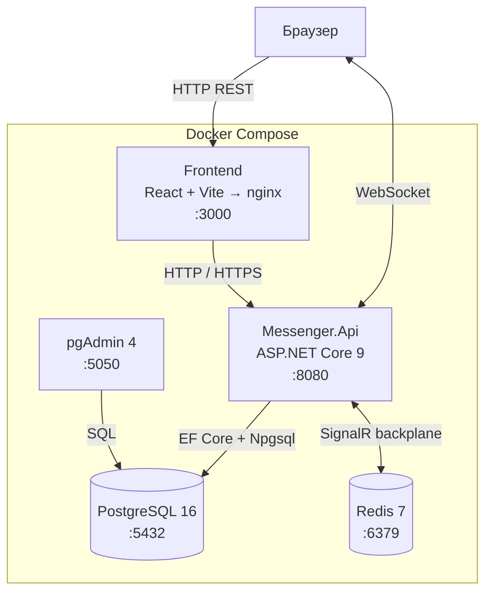
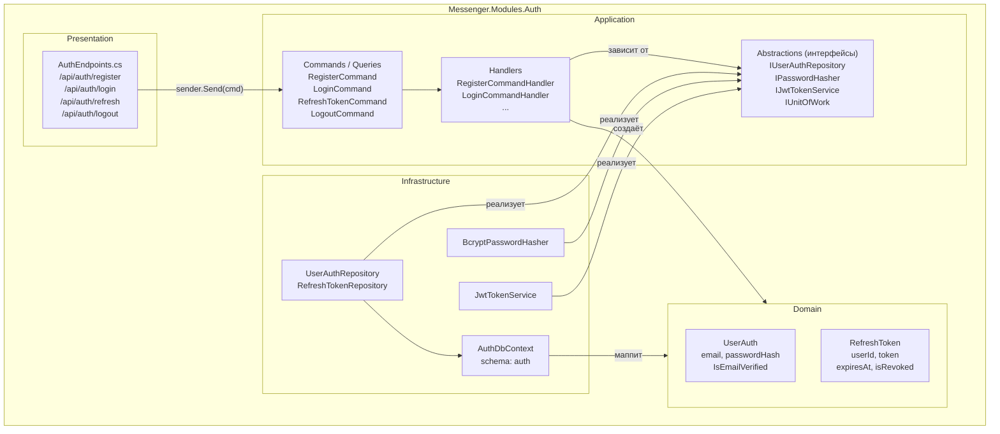
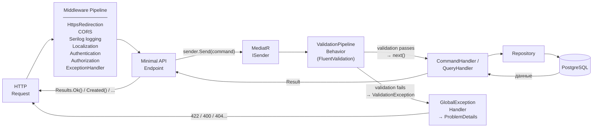
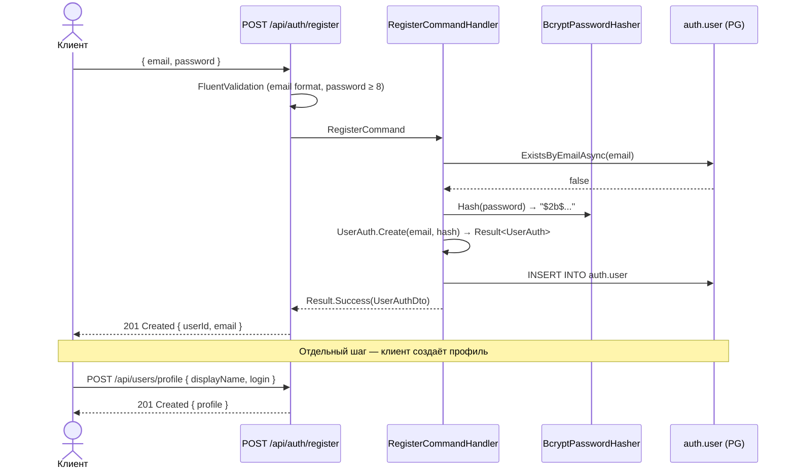
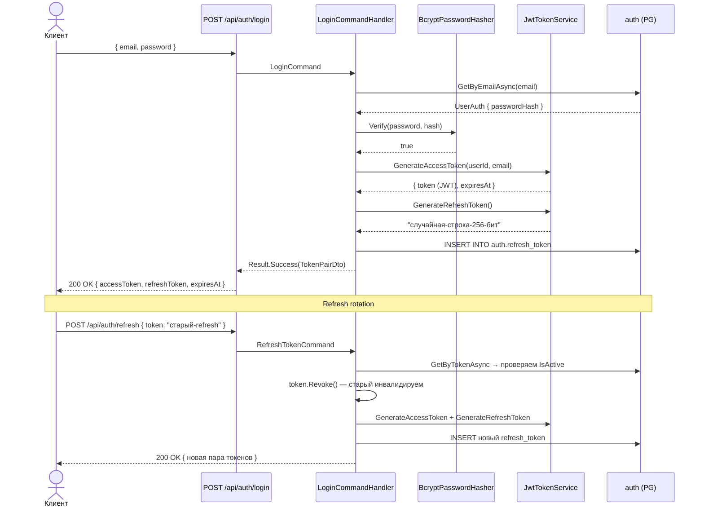
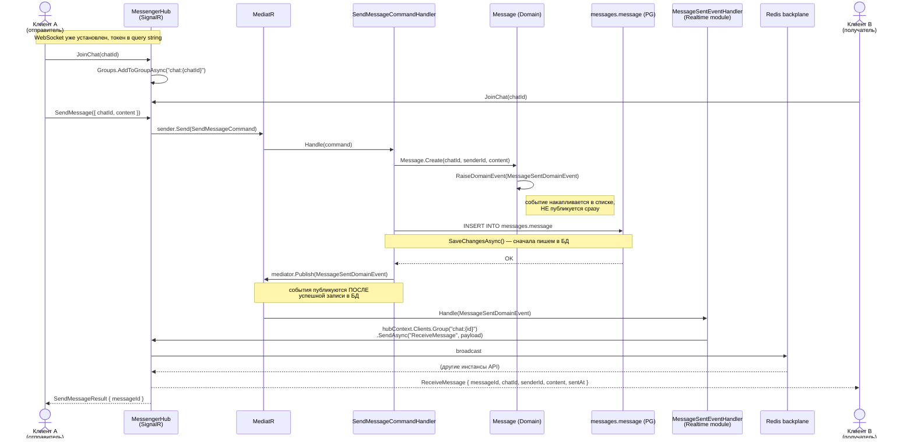
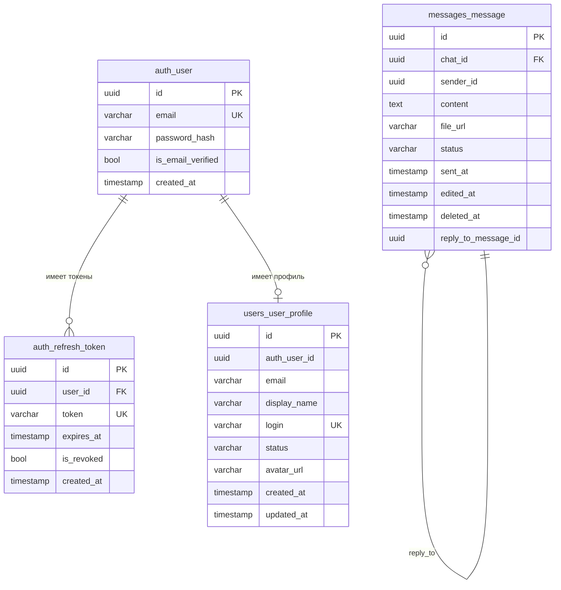

# Схемы архитектуры бекенда

---

## 1. Инфраструктура



---

## 2. Структура модуля (на примере Auth)



---

## 3. Pipeline входящего запроса



---

## 4. Поток аутентификации





---

## 5. Отправка сообщения и реалтайм-доставка



---

## 6. Схема базы данных



> **Важно:** схемы `auth`, `users`, `messages` физически в одной БД PostgreSQL,
> но изолированы на уровне кода — у каждого модуля свой `DbContext`
> и своя таблица `__EFMigrationsHistory`.

---

## 7. Межмодульная связь: кто о ком знает

```mermaid
graph LR
    subgraph "Shared.Kernel (знают все)"
        SK["CQRS interfaces\nResult / Error\nAggregateRoot\nIDomainEvent"]
    end

    subgraph "Модули (изолированы)"
        AUTH["Auth"]
        USERS["Users"]
        MSGS["Messages"]
        RT["Realtime"]
        CHATS["Chats"]
        FILES["Files"]
    end

    AUTH -->|"использует"| SK
    USERS -->|"использует"| SK
    MSGS -->|"использует"| SK
    RT -->|"использует"| SK

    MSGS -->|"публикует\nMessageSentDomainEvent"| MB[("MediatR\n(in-process bus)")]
    RT -->|"подписывается на\nMessageSentDomainEvent"| MB

    MSGS -.->|"НЕТ прямой зависимости"| RT
    AUTH -.->|"НЕТ прямой зависимости"| USERS

    style MSGS -.->|"НЕТ прямой зависимости"| RT fill:none
```
